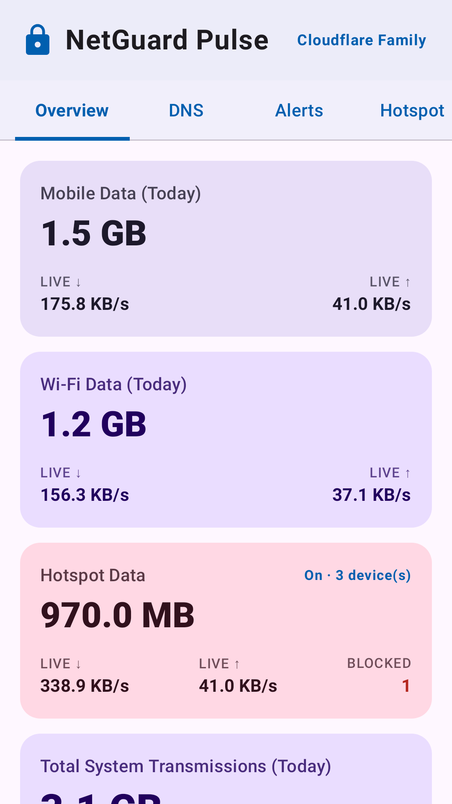
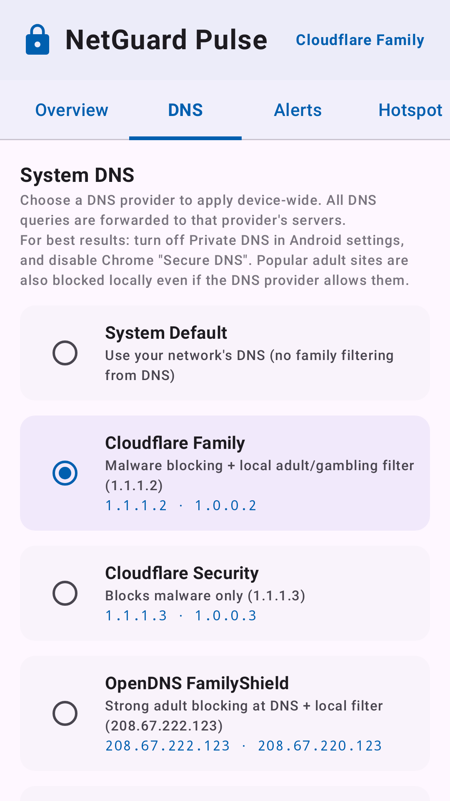
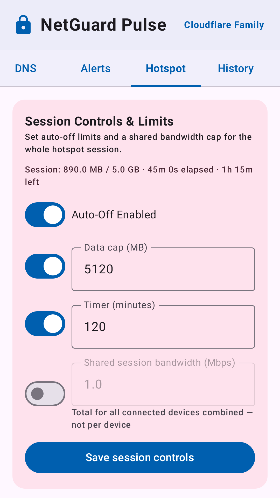
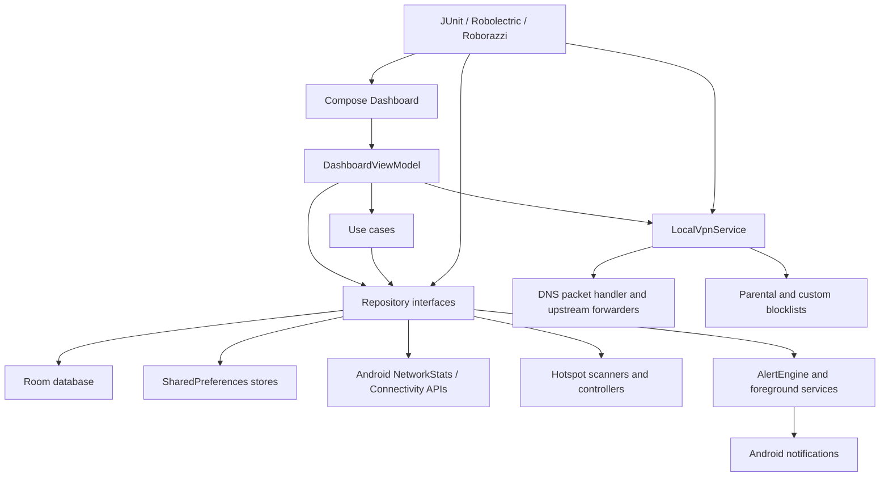

## Header & Badges

<div align="center">
  
</div>

<div align="center">


</div>

NetGuard Pulse is an Android network visibility app for tracking app traffic, reviewing DNS activity, configuring
usage alerts, and monitoring hotspot sessions. The current application ID is `com.michael.netguardplus`.

GitHub repository: [michaelsam94/NetGuard-Pulse](https://github.com/michaelsam94/NetGuard-Pulse.git).

## Project Overview

NetGuard Pulse helps Android users understand data usage from a single dashboard. It is aimed at users who want live
traffic visibility, DNS filtering controls, usage history, and notification-only hotspot session alerts.

The app uses Android `VpnService` only for DNS filtering and domain blocking. Hotspot session thresholds are alert-only:
they do not route hotspot traffic, throttle bandwidth, turn off hotspot, or turn off mobile data.

<table>
  <tr>
    <td></td>
    <td></td>
    <td></td>
  </tr>
</table>

Demo link: Not configured.

## Key Features

- 📊 Live traffic dashboard for mobile, Wi-Fi, hotspot, and total system usage.
- 🔎 Per-app traffic list with current speed and daily byte totals.
- 🛡️ DNS filtering through a local DNS VPN service with family DNS providers and custom blocked domains.
- 🚨 Data alerts for mobile, Wi-Fi, or all-network usage thresholds.
- 📅 Usage history grouped by date range and traffic category.
- 📡 Hotspot client discovery with per-device visibility and usage tracking.
- 🔔 Hotspot session alerts for data and time thresholds, including background notification support.
- 🖼️ Roborazzi-based Play Store screenshots, feature graphic, and app icon generation.

## Architecture Overview



### Components

The presentation layer is built with Jetpack Compose in `presentation/dashboard`. `DashboardViewModel` collects
repository flows, exposes `DashboardUiState`, and emits one-shot dashboard effects.

The domain layer defines models, repository contracts, and use cases in `domain`. This keeps the UI separate from
Android services, Room entities, DNS packet parsing, and hotspot discovery details.

The data layer implements repositories with Room, SharedPreferences, Android traffic APIs, and system services. Room is
used for persistent DNS logs, alerts, traffic summaries, usage history, and hotspot client records.

The system layer contains Android-facing services and helpers: foreground traffic monitoring, DNS VPN, alert delivery,
hotspot scanners, captive portal pieces, packet parsing, and native session-shaper support.

### Data Flow

Live traffic is polled by `NetworkStatsPoller` and stored through `TrafficRepositoryImpl`. DNS filtering starts in
`MainActivity`, obtains Android VPN consent when needed, and runs through `LocalVpnService`. Hotspot session progress is
updated by `HotspotRepositoryImpl`; data changes come from the monitor loop, while the UI redraws session time once per
second for a realtime clock display.

### Design Patterns

The project uses MVVM for UI state, repository interfaces for domain boundaries, Kotlin Flow for reactive updates, and
foreground services for long-running alert and DNS work. Background hotspot session alerts are supported by a guard
foreground service plus `AlarmManager` checks.

## Tech Stack & Libraries

| Layer | Technology | Version | Purpose |
|---|---:|---:|---|
| Language | Kotlin | 2.2.10 | Main Android application language |
| Build | Android Gradle Plugin | 9.1.1 | Android build, packaging, and signing |
| UI | Jetpack Compose BOM | 2024.09.00 | Declarative UI toolkit |
| UI | Material 3 | BOM-managed | Dashboard components and theming |
| AndroidX | Activity Compose | 1.10.1 | Compose activity integration |
| AndroidX | Lifecycle | 2.8.7 | ViewModel and runtime lifecycle APIs |
| Persistence | Room | 2.7.0 | Local database for app data |
| Async | Kotlin Coroutines | 1.10.2 | Background work and Flow collection |
| Networking | OkHttp | 4.10.0 | HTTP/networking support |
| Networking | Retrofit | 2.12.0 | HTTP API client support where needed |
| Serialization | Moshi | 1.15.2 | JSON serialization and code generation |
| Native | CMake / C++ | CMake 3.22.1 minimum | JNI native session-shaper library |
| Testing | JUnit | 4.13.2 | Unit tests |
| Testing | Robolectric | 4.16.1 | Android JVM tests |
| Screenshots | Roborazzi | 1.59.0 | Play Store screenshot and graphic generation |
| Secrets | Secrets Gradle Plugin | 2.0.1 | Reads `.env` and `.env.example` |

## Prerequisites

- macOS, Linux, or Windows with Android Studio installed.
- JDK 17 or newer for the Android Gradle Plugin.
- Android SDK with compile SDK `36.1`, target SDK `36`, and min SDK `26`.
- Android NDK and CMake for `app/src/main/cpp`.
- A physical Android device is recommended for VPN, usage access, notification, and hotspot behavior.
- Google Play release signing credentials for `:app:bundleRelease`.

| Variable | Required | Default | Description |
|---|---:|---|---|
| `KEYSTORE_PATH` | No | `my-upload-key.jks` or `key.properties` `storeFile` | Release keystore path |
| `STORE_PASSWORD` | For release signing | `key.properties` `storePassword` | Keystore password |
| `KEY_PASSWORD` | For release signing | `key.properties` `keyPassword` | Upload key password |
| `GEMINI_API_KEY` | No | `.env.example` example value | Present from AI Studio template; not required for core app features |

## Installation & Setup

1. Clone the repository and enter the project root.

```bash
git clone https://github.com/michaelsam94/NetGuard-Pulse.git
cd NetGuardPulse
```

2. Check the Android build environment.

```bash
./gradlew --version
```

3. Open the project in Android Studio and let it install any missing SDK, NDK, or CMake components.

4. Create a local `.env` only if you need to override values read by the Secrets Gradle Plugin.

```bash
cp .env.example .env
```

5. Configure release signing for Play upload builds. Either keep `key.properties` in the project root or export
   environment variables.

```properties
storeFile=my-upload-key.jks
storePassword=your_store_password
keyAlias=upload
keyPassword=your_key_password
```

6. Build a debug APK.

```bash
./gradlew :app:assembleDebug
```

7. Install on a connected device.

```bash
./gradlew :app:installDebug
```

Database setup: Not applicable. Room creates the local app database on-device.

Development server: Not applicable. This is a native Android app and does not run a local web server.

## Configuration

Project-level Gradle settings live in `gradle.properties`. The app module config is in `app/build.gradle.kts`, including
SDK versions, application ID, signing config, native CMake build, unit-test options, and Roborazzi output settings.

Android permissions and services are declared in `app/src/main/AndroidManifest.xml`. Important services include:

- `LocalVpnService` for DNS filtering through Android `VpnService`.
- `TrafficMonitorService` for foreground data monitoring.
- `HotspotLimitGuardService` for keeping hotspot alert monitoring active.
- `HotspotCaptivePortalService` for local captive-portal support when per-device hotspot limits are enforced.

User-facing Play Store text and assets live in `play-store/`. Regenerate screenshots and graphics after UI changes.

Restart requirements:

- Reinstall or restart the app after manifest or signing changes.
- Rebuild after Gradle, native C++, or resource changes.
- Re-request Android permissions on device when testing usage access, VPN consent, notifications, or battery settings.

## Usage / Quick Start

### Build and Run a Debug App

```bash
./gradlew :app:assembleDebug
./gradlew :app:installDebug
```

On the device, grant usage access so the app can show per-app traffic. When enabling DNS filtering, approve Android's VPN
permission dialog; this permission is used for DNS filtering only.

### Run Focused Session Alert Tests

```bash
./gradlew --no-daemon --no-configuration-cache :app:testDebugUnitTest \
  --tests 'com.michael.netguardplus.HotspotSessionEnforcerTest' \
  --tests 'com.michael.netguardplus.HotspotSessionConfigInputTest'
```

### Generate Play Store Assets

```bash
./gradlew generatePlayStoreAssets
```

Generated Play Store assets are written to `play-store/`.

### Build a Signed Release Bundle

```bash
./gradlew --no-daemon --no-configuration-cache :app:bundleRelease
```

The release bundle is generated at `app/build/outputs/bundle/release/app-release.aab`.

## API Reference

Not applicable. NetGuard Pulse is a native Android application and does not expose a public HTTP API, SDK, CLI, or
library API from this repository.

## Project Structure

```text
.
├── app/
│   ├── build.gradle.kts              # Android app module, signing, tests, dependencies
│   └── src/
│       ├── main/
│       │   ├── AndroidManifest.xml    # Permissions, activity, services, receivers
│       │   ├── cpp/                   # JNI native session-shaper library
│       │   ├── java/com/michael/netguardplus/
│       │   │   ├── data/              # Room, stores, repository implementations
│       │   │   ├── domain/            # Models, repository contracts, use cases
│       │   │   ├── presentation/      # Compose dashboard and ViewModel
│       │   │   ├── system/            # Android services, DNS VPN, alerts, hotspot tools
│       │   │   └── ui/                # Theme definitions
│       │   └── res/                   # App resources, launcher icons, notification icon
│       ├── test/                      # JVM, Robolectric, Roborazzi tests
│       └── androidTest/               # Instrumentation test source set
├── gradle/
│   ├── libs.versions.toml             # Version catalog
│   └── wrapper/                       # Gradle wrapper files
├── play-store/
│   ├── phone/                         # Phone screenshots
│   ├── tablet/                        # Tablet screenshots
│   ├── app-icon-512.png               # Play app icon
│   ├── feature-graphic.png            # Play feature graphic
│   └── listing-descriptions.md        # Store listing copy
├── VerificationGuide.md               # Manual DNS client blocking checklist
├── build.gradle.kts                   # Root Gradle plugin declarations
├── gradle.properties                  # Gradle performance and Kotlin settings
└── settings.gradle.kts                # Repository and module settings
```

## Testing

Unit tests live in `app/src/test/java/com/michael/netguardplus`. Screenshot and Play Store asset tests live under
`app/src/test/java/com/michael/netguardplus/playstore`.

Run the default JVM test suite:

```bash
./gradlew :app:testDebugUnitTest
```

Run a single test class:

```bash
./gradlew :app:testDebugUnitTest --tests 'com.michael.netguardplus.VpnRoutePlannerTest'
```

Run Android instrumentation tests on a connected device:

```bash
./gradlew :app:connectedDebugAndroidTest
```

Generate Roborazzi screenshots and Play Store graphics:

```bash
./gradlew generatePlayStoreAssets
```

Coverage command: Not configured. No JaCoCo, Kover, or coverage task is declared in this repository.

Naming convention: JVM test classes use `*Test.kt`; Play Store screenshot tests are marked with the
`PlayStoreScreenshotTests` JUnit category.

## Deployment

Docker: Not applicable. This is an Android application and no Dockerfile or docker-compose configuration is present.

Release builds are signed through the `release` signing config in `app/build.gradle.kts`.

```bash
./gradlew --no-daemon --no-configuration-cache :app:bundleRelease
```

Upload the generated AAB from:

```text
app/build/outputs/bundle/release/app-release.aab
```

Environment differences:

- `debug` uses `debug.keystore` and `applicationId` `com.michael.netguardplus`.
- `release` uses `my-upload-key.jks`, `key.properties`, or `KEYSTORE_PATH` / password environment variables.
- Play Store assets are generated separately into `play-store/`.

Health check: Not applicable. There is no backend service health endpoint. Validate releases by installing on a device,
testing usage access, DNS VPN consent, notifications, hotspot alerts, and the checklist in `VerificationGuide.md`.

## Contributing

1. Fork or branch from the main development branch.
2. Use concise branch names such as `fix/session-alert-clock` or `feature/dns-history-filter`.
3. Prefer Conventional Commits, for example `fix: update hotspot session timer`.
4. Run relevant unit tests before opening a PR.
5. For UI changes, regenerate or inspect Play Store screenshots when the store-facing screens change.
6. Keep Google Play policy-sensitive wording aligned between app UI, manifest declarations, and
   `play-store/listing-descriptions.md`.

PR checklist:

- Build or focused compile command passed.
- Relevant unit tests passed.
- Manifest permissions and foreground-service declarations still match app behavior.
- Store listing copy updated if user-facing features changed.
- Release AAB rebuilt when preparing a Play Console upload.

Style and lint rules are the Gradle/Kotlin defaults in this repository. A dedicated `./docs/CONTRIBUTING.md` file is not
configured.

## Roadmap

- [ ] Add a dedicated in-app diagnostics screen for permission and service status.
- [ ] Add automated coverage reporting for the JVM test suite.
- [ ] Add a policy checklist for Play Console declarations and store-copy review.
- [ ] Add more instrumentation coverage for foreground notifications and VPN consent flows.
- [ ] Add an export option for DNS logs and usage history.

## License

License type: Not configured.

No `LICENSE` file is present in this repository. All rights are reserved by default until a license is added.

Copyright: Not configured.

## Acknowledgements & Credits

NetGuard Pulse is built on Android, Kotlin, Jetpack Compose, AndroidX Lifecycle, Room, Kotlin Coroutines, OkHttp,
Retrofit, Moshi, Robolectric, and Roborazzi. The app also uses Android platform APIs including `VpnService`,
`NetworkStatsManager`, foreground services, notifications, `AlarmManager`, and hotspot/connectivity APIs.
